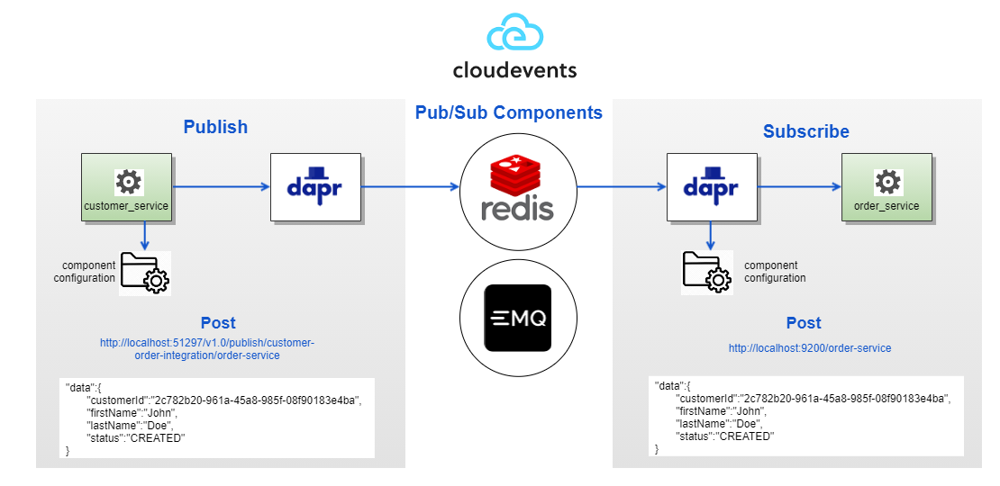

# Customer Service

###  Customer Service, providing REST endpoints for creating/updating/retrieving/deleting customers. It also publishes three types of events to order-service:  
  * 1. CustomerWasCreated
  * 2. CustomerWasUpdated
  * 3. CustomerWasDeleted
  

* **A. Prerequisites**
   * 1. Windows/Linux based operating system
   * 2. Java 11 
   * 3. Dapr CLI (follow instructions on https://docs.dapr.io/getting-started/)
   * 4. Docker (follow instructions on https://docs.docker.com/get-docker/)
   * 5. Database has been created or assuming using an in-memory database for testing purpose.
  

* **B. Getting Started & Run the Application**
   * 1. Clone the git repo in to your local directory from the github repository
        
   * 2. Open the command prompt and navigate to the main project directory.
  
   * 3. Copy mssql.jks file located under rest-controller submodule to under "tmp" directory on your local env. Empty file merely for local testing purpose.

* ** Run Application on Local Docker Containers**

   * 1. Build the application:
        * `mvn clean install`

   * 2. Run the application with Dapr as sidecar WITH docker container:
        * `docker-compose up --build`

   * 3. Tear down the app after running the app (warning: this will delete the contents of your app's database):
        * `docker-compose down`

   * 4. If you don't have Docker installed locally, run the application with Dapr as sidecar locally WITHOUT docker container:
        * `dapr run --components-path ./dapr-components --app-id customer-service --app-port 9100 -- java -jar rest-controller/target/customer-service-0.0.1-SNAPSHOT-exec.jar -p 9100`
    

* **C. Project Code Modules**
    * `config` - Spring Configuration classes for all of the modules.
    * `dapr-components` - dapr components files for pubsub.
    * `data` - Contains domain data shared with other applications such as rest-api, events etc.
    * `persistence` - Responsible for hosting the Entities and Repositories for the database. 
    * `qa` - Integration/Functional Tests.
    * `rest-controller` - REST Endpoints for the application.
    * `service` - Contains business logic for the application.

* **D. Application Launch**
    * web: http://localhost:9100/swagger-ui.html

### PubSub

For testing purpose, we are using EMQ X MQTT public broker [https://www.emqx.io/mqtt/public-mqtt5-broker](https://www.emqx.io/mqtt/public-mqtt5-broker).

